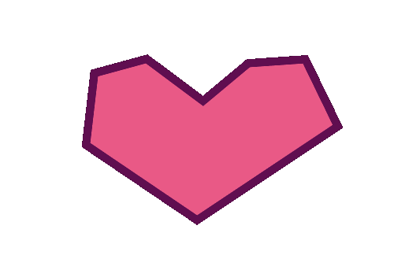

#  Animated Primitive 2D (Primitive 2D)

A Godot 4.7 project built around **Primitive2D**, a small addon for drawing custom 2D vector shapes and morphing them between keyframed poses — all editable directly in the 2D viewport, no separate animation tooling required.

## What's in here

- **`addons/primitive_2d/`** — the addon itself: `Primitive2D` (a static vertex-based shape) and `AnimatedPrimitive2D` (morphs between keyframed poses over time), plus an editor plugin for dragging vertex handles and managing keyframes without touching raw arrays in the Inspector. See [`addons/primitive_2d/README.md`](addons/primitive_2d/README.md) for full details on both nodes, their properties, and the editor workflow.
- **`addons/primitive_2d/demo.tscn`** — a demo scene showing a static `Primitive2D` triangle alongside an `AnimatedPrimitive2D` shape morphing on a loop.

  

## Quick start

1. Open the project in Godot **4.7** or later.
2. Run the project (F5/F6) — it launches `addons/primitive_2d/demo.tscn` by default.
3. Select either shape node in the Scene dock to see the vertex handles; select the animated one to also see the keyframe toolbar above the 2D viewport.

[Video Demonstration](https://youtu.be/IJ8IOjBfREQ)
